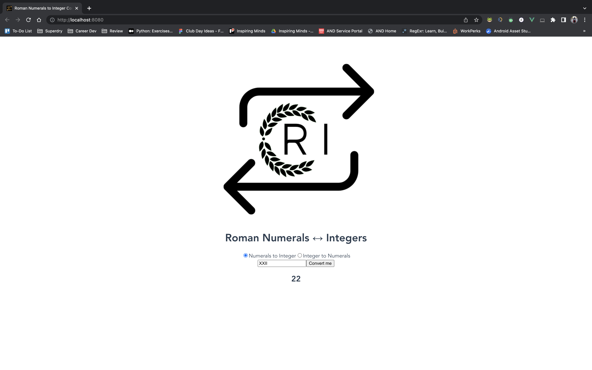
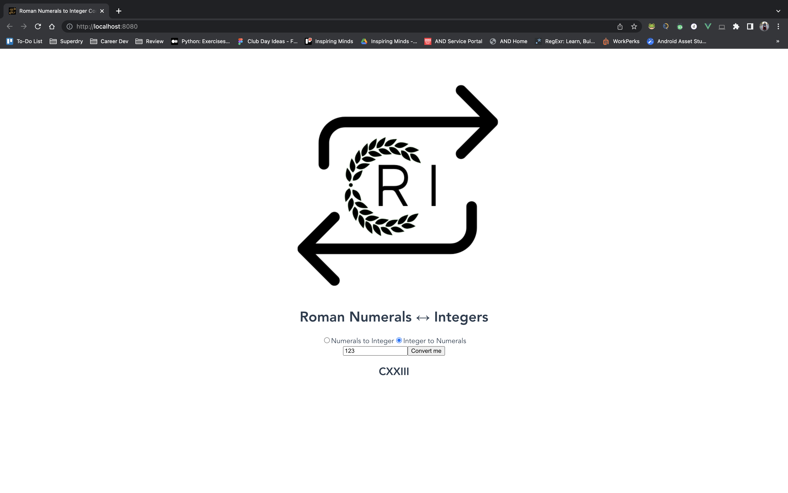

# Frontend
Upskilling on frontend development (namely VueJS) utilising a previously made [containerised API](https://github.com/helenijevans/romanNum-ArabicInt) that converts roman numerals to integers and vice versa.
___
## Project setup
```
npm install
```

### Compiles and hot-reloads for development
```
npm run serve
```

### Compiles and minifies for production
```
npm run build
```

### Lints and fixes files
```
npm run lint
```

___
## Current State of Project




## To-do List

- [ ] Test
- [x] Test
- [x] Test