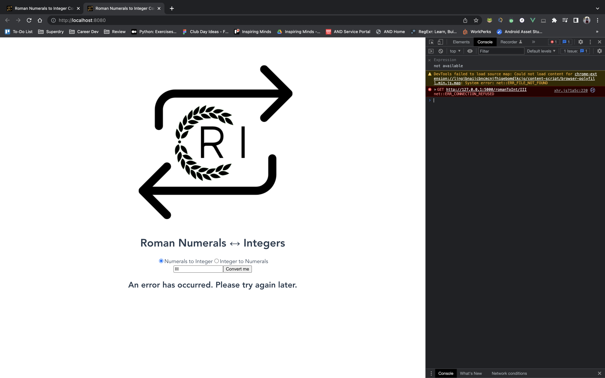
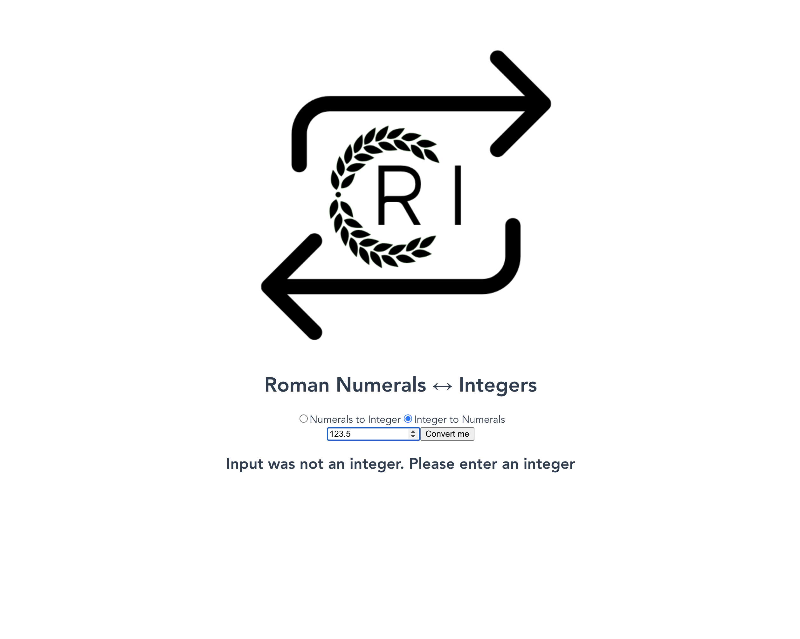
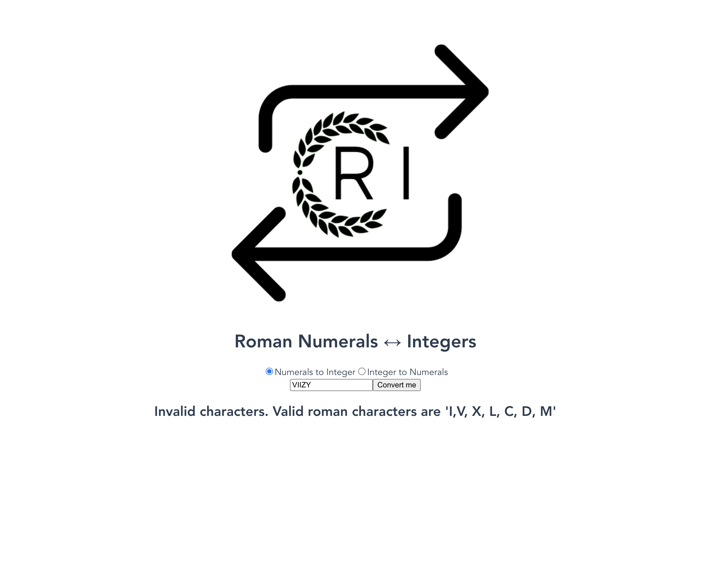

# romanToInt App
Upskilling on frontend development (namely VueJS) utilising a previously made [containerised API](https://github.com/helenijevans/romanNum-ArabicInt) that converts roman numerals to integers and vice versa.
___
## Project setup
```
npm install
```

### Compiles and hot-reloads for development
```
npm run serve
```

### Compiles and minifies for production
```
npm run build
```

### Lints and fixes files
```
npm run lint
```

___
## Current State of Project
### 🔃 Conversion Rom-Int


### 🔃 Conversion Int-Rom


### ❌ Error Handling | Server Error


### ❌ Error Handling | Integer Error


### ❌ Error Handling | Roman Character Error



## To-do List
- [ ] Feedback from CC
- [x] Prevention/Input Backend
- Validation to check if in valid subset of roman characters (ROM-INT), or if the number entered was an integer (INT-ROM) 
- [x] Prevention/Input Validation Frontend
- Restricted input to text (ROM-INT) and number (INT-ROM)
- [x] Feedback from CC
- [x] Adapt FE to show errors
- [x] Adapt API to fix
- Added a check for if the number is greater than the maximum number in the dictionary, allowing for quick multiples to be dealt with before using the rest of the comparative logic
- [x] Figure out what is happening with numbers >= 4000 (API throws an error)
- 4000 was the first number where logic broke, this is because the program thinks (based on the sequence logic) that there is a numeral for 5000, and hence 4000 would be similar in nature to 4, 40 (IV, IL etc.)
- [x] Figure out if there's a limitation on Rom -> Int Inputs (limitation found on the vice versa)
- No there isn't a limitation
- [x] Make sure box clears after switching between modes
- [x] Logo :D
- [x] Get base functionality working
